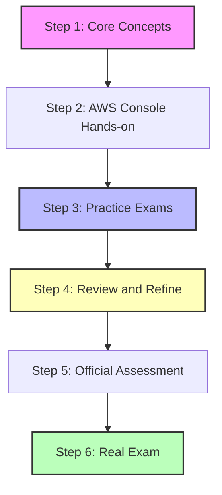

# AWS Certified AI Practitioner (AIF-C01) Resources Guide

This guide compiles official and top-tier third-party resources to prepare for the **AWS Certified AI Practitioner (AIF-C01)** certification.

---

## 1. Exam Overview
The AWS Certified AI Practitioner (AIF-C01) validates a foundational, high-level understanding of artificial intelligence (AI), machine learning (ML), and generative AI (GenAI) technologies, along with their associated use cases and services on AWS.

* **Format:** 65 questions (multiple-choice or multiple-response). 
* **Duration:** 90 minutes.
* **Cost:** $100 USD.
* **Passing Score:** 700 / 1000.
* **Delivery Method:** Pearson VUE testing center or online proctored exam.

### Exam Domains
| Domain | Weight | Description |
| :--- | :--- | :--- |
| **Domain 1: Fundamentals of AI and ML** | 20% | Explain core AI/ML concepts, training methodologies, regression/classification, and model metrics. |
| **Domain 2: Fundamentals of Generative AI** | 24% | Define generative AI architectures, large language models (LLMs), tokenization, and temperature settings. |
| **Domain 3: Applications of Foundation Models** | 28% | Understand foundation models (FMs), prompt engineering, fine-tuning, RAG, and Bedrock services. |
| **Domain 4: Guidelines for Responsible AI** | 14% | Identify bias, fairness, transparency, safety guardrails, and ethical AI deployment on AWS. |
| **Domain 5: Security, Compliance, and Governance** | 14% | Describe data protection, privacy guidelines, regulatory compliance, and security governance for AI. |

---

## 2. Official AWS Resources

Always start with the official resources provided by AWS, as they set the baseline standard for exam topics.

* **[Official AWS Certified AI Practitioner Page](https://aws.amazon.com/certification/certified-ai-practitioner/):** The primary hub for scheduling the exam, viewing FAQs, and checking system requirements.
* **[Official AIF-C01 Exam Guide (PDF)](https://d1.awsstatic.com/training-and-certification/docs-ai-practitioner/AWS-Certified-AI-Practitioner_Exam-Guide.pdf):** Detailed breakdown of every single objective, task statement, and service in-scope.
* **[AWS Skill Builder](https://explore.skillbuilder.aws/):** The official AWS digital learning center. Key offerings for AI Practitioner:
  * **Exam Prep Plan: AWS Certified AI Practitioner (AIF-C01):** A structured learning path including digital courses, hands-on labs, and flashcards.
  * **Official Practice Question Set:** A free set of practice questions reflecting the style of the real exam.
  * **Official Pretest & Practice Exam:** Available through AWS Skill Builder to assess your readiness (some full-length practice tests may require a subscription).
* **[AWS Free Tier](https://aws.amazon.com/free/):** Highly recommended to get hands-on experience in the AWS Management Console with services like **Amazon Bedrock**, **Amazon SageMaker**, and **Amazon Q**.

---

## 3. High-Quality Third-Party Resources

Candidates frequently supplement official materials with highly rated courses and practice tests.

### Udemy
Udemy is the most popular platform for affordable, exam-focused preparation materials.
* **[AWS Certified AI Practitioner (Stéphane Maarek)](https://www.udemy.com/course/aws-certified-ai-practitioner/):**
  * **Description:** Widely considered the gold-standard video course. Highly structured, regularly updated, and contains hands-on demonstrations.
  * **Best For:** Comprehensive video learning.
* **[AWS Certified AI Practitioner (Frank Kane)](https://www.udemy.com/):**
  * **Description:** Detailed conceptual guide covering big data, machine learning fundamentals, and generative AI architectures.
  * **Best For:** Conceptual depth and architectural overview.

### Tutorials Dojo
* **[AWS Certified AI Practitioner Practice Exams (Jon Bonso)](https://portal.tutorialsdojo.com/):**
  * **Description:** Renowned for high-quality practice question pools that mirror the complexity and wording of the actual exam. Includes detailed explanations for every correct and incorrect answer.
  * **Best For:** Test readiness verification.

### freeCodeCamp & ExamPro (Andrew Brown)
* **[freeCodeCamp 10+ Hour YouTube Course](https://www.youtube.com/):**
  * **Description:** A completely free, comprehensive course covering all necessary domains with visual explanations, slide decks, and mock questions.
  * **Best For:** Free, in-depth video training.

---

## 4. Recommended Study Strategy

To pass the AIF-C01 exam on your first attempt, follow this structured plan:

### Phase 1: Core Concepts (1.5 - 2 Weeks)
* Go through a structured video course (e.g., Stéphane Maarek on Udemy or Andrew Brown on freeCodeCamp).
* Read the **[AWS Certified AI Practitioner Exam Guide](https://d1.awsstatic.com/training-and-certification/docs-ai-practitioner/AWS-Certified-AI-Practitioner_Exam-Guide.pdf)** to track which services you need to focus on.
* Learn AI/ML core terms: overfitting vs. underfitting, training/validation datasets, classification vs. regression, neural network weights/layers, LLM context windows, and tokenization.

### Phase 2: Console Exposure (Parallel with Phase 1)
* Open an **AWS Free Tier Account**.
* Explore **Amazon Bedrock**: play with foundational models (Anthropic Claude, Meta Llama, Amazon Titan) inside play pens, adjusting temperature and top-p.
* Explore **Amazon SageMaker Canvas**: look at no-code model building.
* Explore **Amazon Q**: test automated business chat functions.

### Phase 3: Practice Tests (1 - 2 Weeks)
* Take practice exams (e.g., Tutorials Dojo or official AWS Skill Builder questions).
* **Crucial Rule:** Do not just look at your score. Read the detailed explanations for every question you get wrong (and even the ones you guessed right). Use these explanations to fill in knowledge gaps.

### Phase 4: Final Review (2 - 3 Days)
* Review cheat sheets/flashcards (like those from Tutorials Dojo or ExamPro).
* Focus on areas where candidates commonly lose marks:
  * Responsible AI principles (bias, explainability, safety, governance).
  * Prompt engineering techniques (zero-shot, few-shot, chain-of-thought, retrieval-augmented generation).
  * Security policies (Bedrock Guardrails, KMS key encryption, IAM security access).
