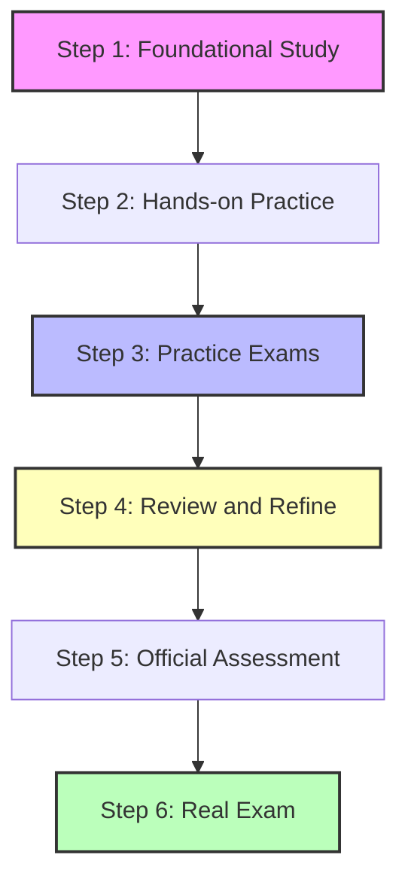

# AWS Certified Cloud Practitioner (CLF-C02) Resources Guide

This guide compiles official and top-tier third-party resources to prepare for the **AWS Certified Cloud Practitioner (CLF-C02)** certification.

---

## 1. Exam Overview
The AWS Certified Cloud Practitioner (CLF-C02) validates a foundational, high-level understanding of the AWS Cloud, including basic concepts, services, security, architecture, billing, and support.

* **Format:** 65 questions (multiple-choice or multiple-response). 
* **Duration:** 90 minutes.
* **Cost:** $100 USD.
* **Passing Score:** 700 / 1000.
* **Delivery Method:** Pearson VUE testing center or online proctored exam.

### Exam Domains
| Domain | Weight | Description |
| :--- | :--- | :--- |
| **Domain 1: Cloud Concepts** | 24% | Define the AWS Cloud value proposition, cloud economics, and basic cloud architecture design principles. |
| **Domain 2: Security and Compliance** | 30% | Understand the AWS Shared Responsibility Model, compliance, security concepts, and access management (IAM). |
| **Domain 3: Technology** | 34% | Identify core services (Compute, Storage, Database, Networking), deployment/operating models, and tech support. |
| **Domain 4: Billing, Pricing, and Support** | 12% | Describe AWS pricing models, billing features, and resources available for billing support. |

---

## 2. Official AWS Resources

Always start with the official resources provided by AWS, as they set the baseline standard for exam topics.

* **[Official AWS Certified Cloud Practitioner Page](https://aws.amazon.com/certification/certified-cloud-practitioner/):** The primary hub for scheduling the exam, viewing FAQs, and checking system requirements.
* **[Official CLF-C02 Exam Guide (PDF)](https://d1.awsstatic.com/training-and-certification/docs-cloud-practitioner/AWS-Certified-Cloud-Practitioner_Exam-Guide.pdf):** Detailed breakdown of every single objective, task statement, and service in-scope. 
* **[AWS Skill Builder](https://explore.skillbuilder.aws/):** The official AWS digital learning center. Key offerings for Cloud Practitioner:
  * **AWS Cloud Practitioner Essentials:** A free, self-paced, 6-hour digital course covering fundamental concepts and core services.
  * **Official Practice Question Set:** A free set of 20 practice questions reflecting the style of the real exam.
  * **Official Pretest & Practice Exam:** Available through AWS Skill Builder to assess your readiness (some full-length practice tests may require a subscription).
* **[AWS Free Tier](https://aws.amazon.com/free/):** Creating a free tier account is highly recommended to get hands-on experience in the AWS Management Console, which helps reinforce conceptual knowledge.

---

## 3. High-Quality Third-Party Resources

Candidates frequently supplement official materials with highly rated courses and practice tests.

### Udemy
Udemy is the most popular platform for affordable, exam-focused preparation materials.
* **[Ultimate AWS Certified Cloud Practitioner (Stéphane Maarek)](https://www.udemy.com/course/aws-certified-cloud-practitioner-clf-c02/):**
  * **Description:** Widely considered the gold-standard video course. Highly structured, regularly updated, and contains hands-on demonstrations.
  * **Best For:** Comprehensive video learning.
* **[AWS Certified Cloud Practitioner Practice Exams (Tutorials Dojo / Jon Bonso)](https://portal.tutorialsdojo.com/):**
  * **Description:** Renowned for high-quality practice question pools that mirror the complexity and wording of the actual exam. Includes detailed explanations for every correct and incorrect answer.
  * **Best For:** Test readiness verification.

### freeCodeCamp & ExamPro (Andrew Brown)
* **[freeCodeCamp 14+ Hour YouTube Course](https://www.youtube.com/watch?v=Ia-gxpL1rDU):**
  * **Description:** A completely free, comprehensive course led by Andrew Brown (ExamPro). It covers all necessary domains with visual explanations and slides.
  * **Best For:** Free, in-depth video training.
* **[ExamPro CLF-C02 Course Platform](https://www.exampro.co/clf-c02):**
  * **Description:** Andrew Brown’s specialized platform offering flashcards, cheat sheets, and practice exams to accompany the course.

### A Cloud Guru (ACG) / Pluralsight
* **[AWS Certified Cloud Practitioner Course](https://www.pluralsight.com/):**
  * **Description:** A subscription-based learning library. Offers structured videos, interactive labs, and practice questions.
  * **Best For:** Students who prefer subscription models or have corporate access. Supplementing with external practice tests is still recommended.

### Edureka
* **[AWS Course Offerings & YouTube Playlists](https://www.edureka.co/):**
  * **Description:** Edureka provides instructor-led live training as well as high-level YouTube overview videos.
  * **Best For:** Initial concept familiarization and high-level summaries.

---

## 4. Recommended Study Strategy

To pass the CLF-C02 exam on your first attempt, follow this structured plan:

### Phase 1: Core Concepts (1.5 - 2 Weeks)
* Go through a structured video course (e.g., Stéphane Maarek on Udemy or Andrew Brown on freeCodeCamp).
* Read the **[AWS Certified Cloud Practitioner Exam Guide](https://d1.awsstatic.com/training-and-certification/docs-cloud-practitioner/AWS-Certified-Cloud-Practitioner_Exam-Guide.pdf)** to track which services you need to focus on.

### Phase 2: Console Exposure (Parallel with Phase 1)
* Open an **AWS Free Tier Account**.
* Spin up simple services like an EC2 instance, an S3 bucket, and explore the IAM console. This makes abstract concepts much easier to remember.

### Phase 3: Practice Tests (1 - 2 Weeks)
* Do **not** rely on videos alone.
* Take practice exams (e.g., Tutorials Dojo or official AWS Skill Builder questions).
* **Crucial Rule:** Do not just look at your score. Read the detailed explanations for every question you get wrong (and even the ones you guessed right). Use these explanations to fill in knowledge gaps.

### Phase 4: Final Review (2 - 3 Days)
* Review cheat sheets/flashcards (like those from Tutorials Dojo or ExamPro).
* Focus on areas where candidates commonly lose marks:
  * Shared Responsibility Model (who secures what).
  * AWS Well-Architected Framework (6 pillars).
  * Billing and pricing calculators.
  * Support plans (Developer vs. Business vs. Enterprise).
